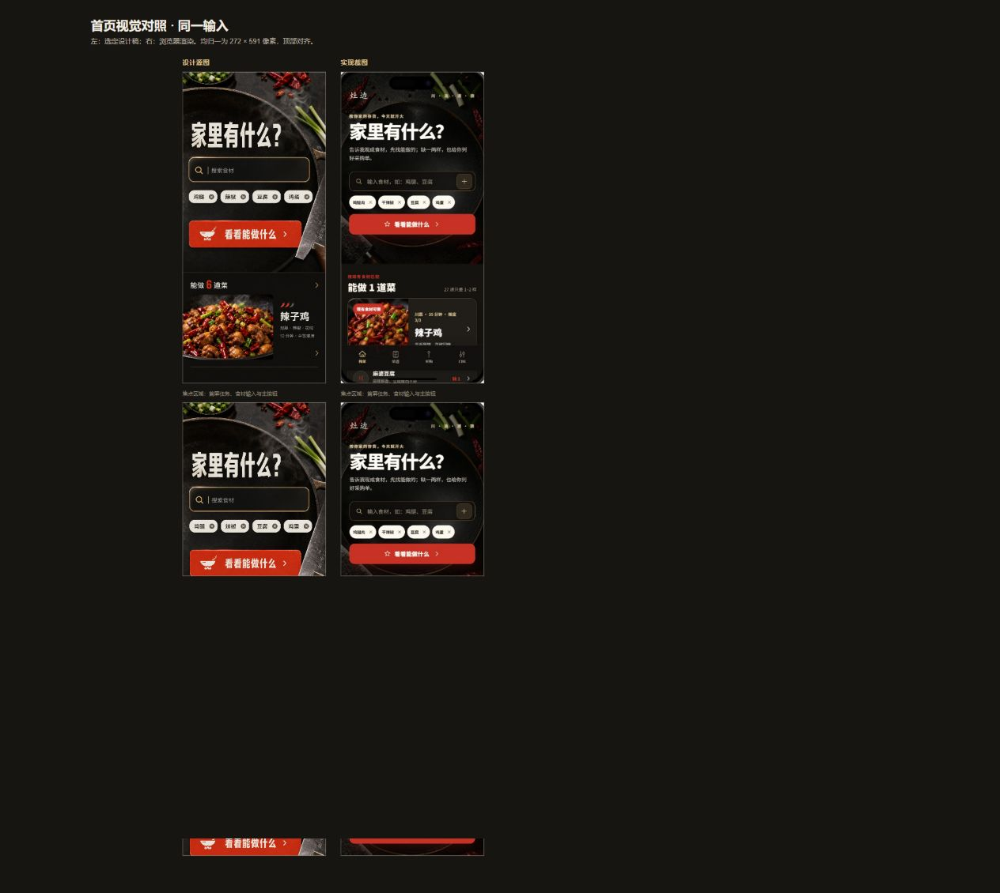
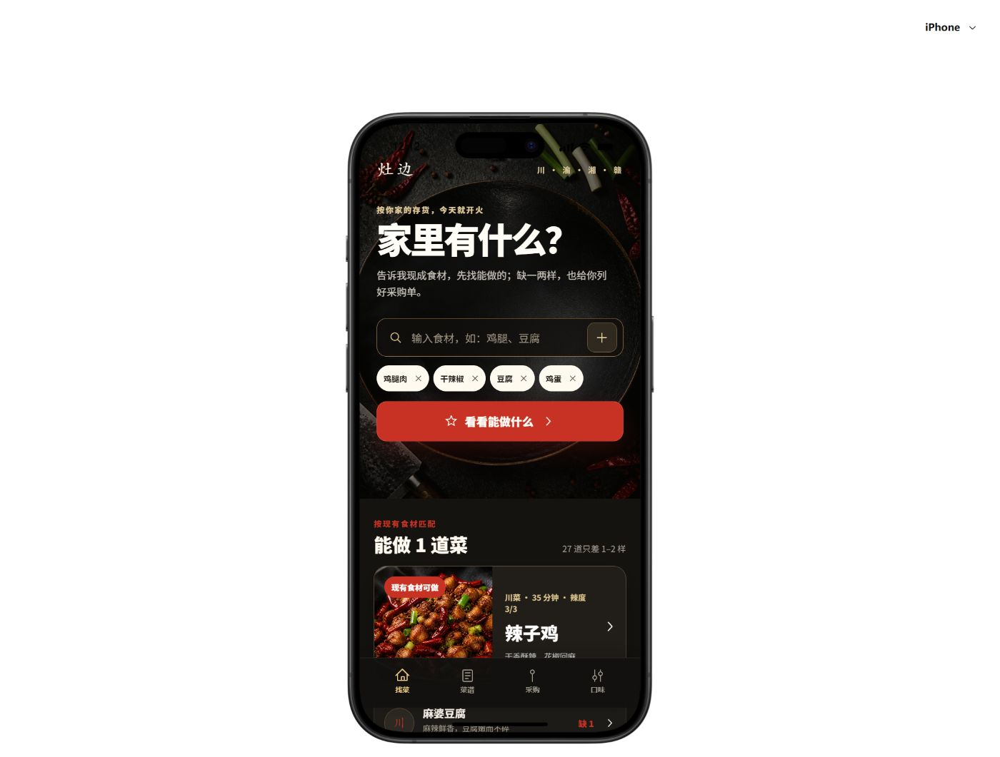

# 演示与质量验证截图

本目录索引仓库内的演示、设计对照和交互验证素材。图片均为项目迭代过程中的真实运行截图。

## 设计与首页实现

### iPhone 首页实现

### 设计与实现对照

### 完整视口

## 最终交互验证

| 场景 | 截图 |
| --- | --- |
| 新用户空库存 | [01-new-user-empty.png](../audit/final-qa/01-new-user-empty.png) |
| 输入框聚焦 | [02-focused-draft.png](../audit/final-qa/02-focused-draft.png) |
| 点击外部关闭键盘并保留草稿 | [03-outside-dismiss-preserves-draft.png](../audit/final-qa/03-outside-dismiss-preserves-draft.png) |
| CTA 提交并生成排序结果 | [04-cta-ranked-result.png](../audit/final-qa/04-cta-ranked-result.png) |
| 排序结果稳定 | [05-cta-ranked-result-settled.png](../audit/final-qa/05-cta-ranked-result-settled.png) |
| 键盘完全关闭 | [06-cta-keyboard-fully-hidden.png](../audit/final-qa/06-cta-keyboard-fully-hidden.png) |
| Pixel 10 匹配结果 | [07-pixel-ranked-result.png](../audit/final-qa/07-pixel-ranked-result.png) |
| 详情页返回后状态稳定 | [08-detail-back-stable.png](../audit/final-qa/08-detail-back-stable.png) |

## 历史缺陷复现

`audit/keyboard-flow/` 保留键盘与输入交互修复前的复现证据，便于理解回归测试来源：

- [初始状态](../audit/keyboard-flow/01-home-existing-state.png)
- [输入聚焦](../audit/keyboard-flow/02-input-focused.png)
- [点击外部后键盘仍显示](../audit/keyboard-flow/03-outside-tap-keyboard-still-visible.png)
- [查看菜品后键盘未关闭](../audit/keyboard-flow/04-see-with-unsubmitted-input-keyboard-stays.png)

自动化交互用例位于 `tests/prototype-navigation.spec.ts` 和 `tests/mobile-runtime.spec.ts`。
