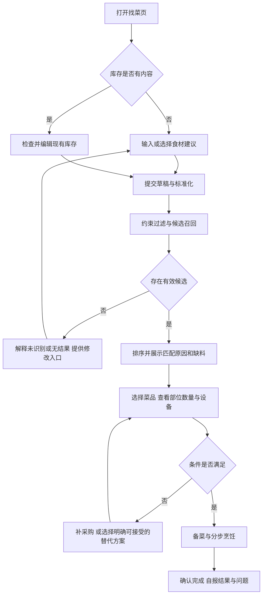
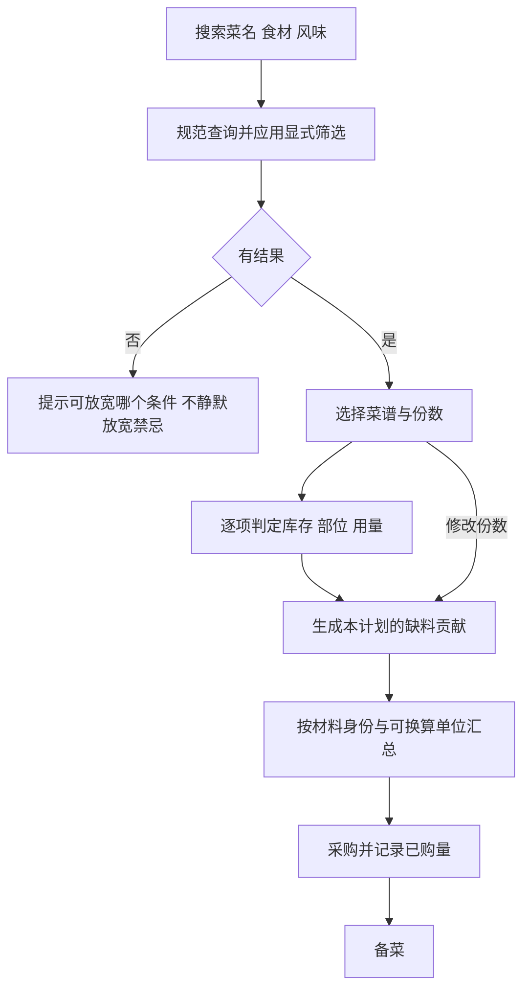

# 功能、平台流程与产品规格

## 功能分层

| 功能 | 核心契约 | SpicyLab基线 | 推荐优先级 |
|---|---|---|---|
| 库存输入 | 批量分隔、去重、空态、可编辑 | 名称列表已有 | P0 |
| 找菜与搜索 | 召回和拥有分离、解释排序 | 食材族已有、粒度需改进 | P0 |
| 菜谱详情 | 自有成菜图、材料、步骤、安全 | 已有，待完整内容审校 | P0 |
| 采购 | 同单位汇总、来源、幂等 | 已有，份数变化待升级 | P0 |
| 口味与人数 | 份数同步、工艺适配、不降安全条件 | 简化系数已有 | P0 |
| 收藏/本机保存 | 明确本机范围、损坏恢复 | 已有 | P0 |
| 库存数量与日期 | 未知不冒充充足、过期不优先消耗 | 未实现 | P1 |
| 烹饪计时/大字模式 | 熄屏恢复、绝对时间、湿手操作 | 不按既有功能宣称 | P1 |
| 家庭协作与计划 | 同步冲突、成员禁忌、计划实例 | 未实现 | P1/P2 |
| 语音/图像识别 | 可编辑确认、错误恢复 | 未实现 | 按验证价值决定 |
| 付费课/电商/UGC | 履约、审校、退款、投诉 | 未实现 | 单独业务立项 |

每个功能附：用户故事、输入、状态、输出、依赖、异常、埋点、验收、版本边界。优先级来自核心闭环和风险，不按页面好看程度排序。缺安全提示与错误可做判定优先于动画。

## 信息架构

```text
找菜：库存/草稿 → 可做与相关结果 → 详情
菜谱：查询/菜系/筛选 → 结果 → 详情
详情：照片/适用条件 → 原料与缺料 → 口味人数 → 步骤 → 完成反馈
采购：待购/已购 → 来源计划与数量 → 修改/撤销/清除
口味：人数/辣麻咸油 → 禁忌独立设置（扩展）→ 常备食材
```

## 从库存做饭的流程图



## 从菜名采购的流程图



## 内容运营流程


未完成试做的菜谱标“编辑整理/待试做”，不要给出“百试百灵”徽章。急需修正的安全内容可以先下线对应版本，记录受影响菜单和通知范围。

## 数据与状态边界

草稿是暂存状态；库存是确认数据；搜索结果是派生状态；采购是计划贡献的聚合；UI导航不应携带第二套领域状态。菜谱版本变更不能静默改变用户已确定的采购计划。

主状态至少考虑：空、编辑、提交中、成功、有相关但未满足、完全无结果、错误、恢复。异步搜索应防止旧响应覆盖新查询；离线时说明内容版本与可用功能，不把失败显示成无菜可做。

## 功能验收示例

“返回不遮挡”不能只验页面第一次加载：进入菜谱→滚到底→打开毛血旺→返回→再次滚到底→切采购→切回→打开键盘并关闭，最后一行和按钮均能完整进入可见可点击区。

“支持多条件”需明确 AND/OR：如“鱼肉 蒸菜”默认两个条件都满足；同一筛选组多选可按OR，不同组按AND。若降级提供相关结果，单独分组并说明放宽了什么，过敏硬约束不降级。

“可做”须在PRD明确定义是主料可做、全部材料名称齐全还是数量设备都满足。界面文案、测试断言与指标定义使用同一口径。
