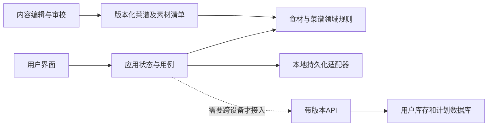

# 架构、发布、测试与交付

## 原型与生产架构分开

SpicyLab当前为React/TypeScript/Vite前端，移动设备框运行时、结构化菜谱、纯函数领域逻辑、本地reducer与localStorage，Sites/Worker兼容静态输出。该结构足以服务本地匿名原型，不应为“后端架构师”这个称呼虚构后端。

升级方向按需求决定：



可选生产API：查询菜谱、获取固定版本详情、保存库存批次、替换计划贡献、读取采购聚合。写操作采用请求ID防重、用户隔离、乐观版本冲突与可恢复错误；服务端重算关键缺料，不能仅信任客户端金额/权限。登录、支付、同步仅在范围内实现。

## 数据契约

菜谱内容有稳定ID与独立版本；图片manifest有recipeId、assetId、类型、来源、优化文件与hash。库存、配方、计划、采购分别存储；相关匹配不能消耗库存。偏好调整生成派生配方，不修改原版。用户本地数据有schema版本，迁移失败尽量保留可恢复原始数据，不能静默全清。

源数据与派生结果分开，防止详情和采购采用不同的缺料算法。输入解析、匹配、排序、缩放、聚合保持可独立运行，UI只承接结果；不在渲染阶段写存储或启动重复计时器。

## 测试层次与证据

| 层次 | 验证内容 | 不足以证明 |
|---|---|---|
| 单元/领域 | 别名、关系、排序、数量、计划幂等 | UI正常、食材实际安全 |
| 数据/素材 | ID唯一、图可解码、材料与步骤引用 | 图片真实试做、菜谱可口 |
| 浏览器交互 | 输入、中文组合、返回、安全区、重复路径 | 所有真机系统键盘 |
| 真机/可用性 | 实际键盘、字号、灶台操作、跨浏览器 | 长期所有网络均可达 |
| 线上冒烟 | 指定版本、匿名请求、资源、关键任务 | 完整功能或未来可用性 |
| 内容审校/试做 | 操作正确、完成条件、安全、口味变体 | 经营法规全自动合规 |

不能只测“有按钮”和“有36个数组项”。每个真实缺陷形成输入、操作、期望及失败信号明确的回归案例。前端不响应时先看实际事件、焦点、路由、错误日志与重渲染，少用猜测式大改。

SpicyLab历史命令为`npm run check:runtime`、领域测试、`npm run test:runtime`、`npm run build`及`npm run test:sites`；新项目先读package和契约，不盲套命令。固定28个runtime文件是该模板的维护约束，不应变成所有产品规则。

## 发布链路与回退

```text
源代码提交 + 素材清单
→ 依赖锁定与构建
→ 校验产物中的入口和全部运行图
→ 发布指定环境
→ 记录版本/提交/hash
→ 匿名外部访问与关键任务核验
→ 保留前一版本回退入口
```

用户授权发布已有网站时沿用目的地；忽略域名讨论不自动表示忽略发布目标。没有发布授权则完成本地结果并标状态，不把本地预览称线上。

“public”是权限设置；HTTP成功、HTML实际渲染、资源加载、真实网络/设备访问是另外的证据。Cloudflare阻断先看响应、headers、登录保护、DNS/TLS和实际服务器日志，不能仅因提到Cloudflare就诊断防护；改slug不改变根域名网络策略。

PWA缓存需有版本、更新路径和回滚策略。缓存查询参数不是部署证据；核验页面构建标识和资源hash。网络优先/离线优先按资源性质选择，明确离线数据是否完整。登录与私有数据不得无意进入共享缓存。

## 资产与GitHub交接

交接清单：源码、锁文件、运行图、母版、字体/设备素材说明、设计与规格、测试与演示、来源与授权、构建/启动说明、版本和已知限制。依赖、缓存、构建产物可再生，是否另给发布zip按用户需求决定。

上传前检查目标仓库和分支，保留历史不强推；敏感配置与凭据不入库。公开仓库不自动赋予第三方素材许可，也不自动说明用户想选某种开源许可证。

交付验收用文件数和hash核对完整性，但数量相等不等于语义相同；核查运行时路径引用和大小写。在GitHub上传后比对本地与远端提交；发布站点则比对部署版本，这两个动作分别证明。

## 可观测性与运营

事件建议：query_submitted、results_shown、recipe_opened、plan_updated、shopping_checked、cook_started、cook_self_reported_complete。避免默认记录完整饮食禁忌或未经允许的原始输入；用事件版本和匿名聚合满足研究需求。

指标定义写清分母：无结果率、可做误报率、采购修正率、首个有效结果耗时、任务完成率、返回错误率、图片加载失败率、内容投诉关闭时间。性能预算和报警门槛由设备/网络基线制定，不把示例数字写成已达成SLA。
